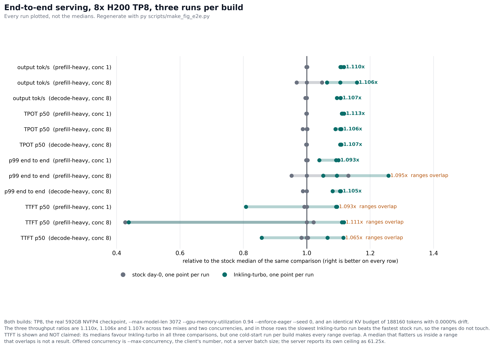
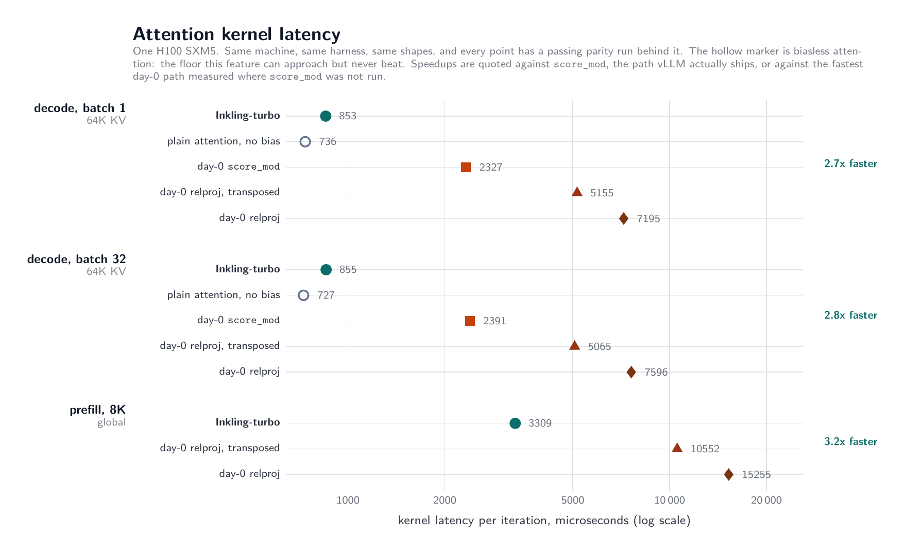
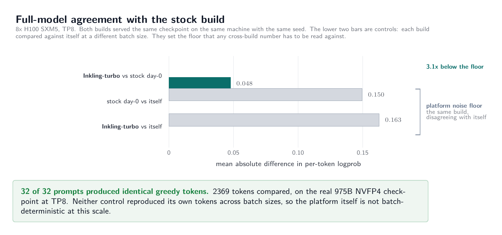
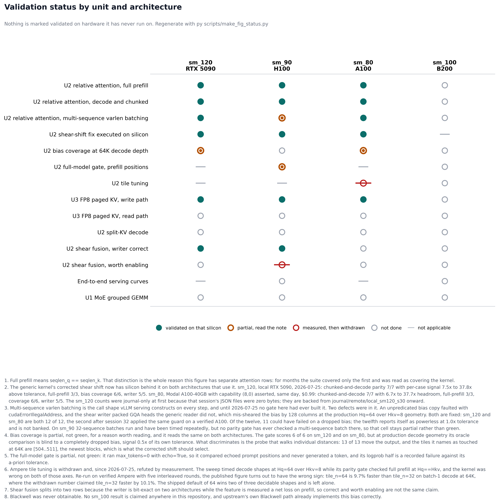

# Inkling-turbo

Open-source attention kernels for serving TML's Inkling on vLLM.

Inkling's attention is not standard. There is no RoPE. The model adds a learned relative-position term to every pre-softmax score, and it alternates global and sliding-window layers. Stock FlashAttention paths do not cover that shape, so vLLM's day-0 support implements the bias with a per-score callback, `score_mod`, on every architecture that is not Blackwell.

This repo replaces the callback with a tile-level sheared-bias kernel. The bias is built as a tile, laid out sheared so that a contiguous tile lines up with the scores it belongs to, and added to the MMA accumulator in one pass before softmax. The checkpoint is untouched. No quantization change, no retraining, no change to the attention math. Only the kernel and the code that dispatches to it.

## What is here that was not here before

Five things. The speed number is deliberately last, because attention is a slice of serving time and the first four are capabilities and defects rather than percentages.

**1. Inkling has an attention *kernel* on A100, and as of 2026-07-25 it is measured there rather than inferred.** Day-0 has none. The model router sends everything that is not Blackwell to `score_mod`, and the cute backend hard-blocks `score_mod` on SM8x with a `NotImplementedError`. The two pieces of routing logic disagree and nothing checks between them, so the failure arrives at the first attention call, after the weights are resident and the KV cache is allocated. Our generic sheared-bias kernel runs there. On a verified A100-SXM4-40GB, capability (8,0) asserted in the run's `env_proof`: full prefill **3/3**, chunked prefill and decode **7/7** with per-case headroom of 6.7x to 37.7x over tolerance, bias extent to 64K **6/6**, multi-sequence varlen **12/12**, fused qkvr prep **5/5**. Two sessions, $1.60 total: [session 31](journal/remote/validate_a100x1_s31/) found a `pack_gqa` shear defect there and [session 32](journal/remote/validate_a100x1_s32_packgqa/) ran the fix.

Because no day-0 path executes on that arch, this is a support result and not a speed result, and **no speedup is claimed on Ampere**: all 13 day-0 arms raise `NotImplementedError` there, so there is no baseline to divide by. It is also **not a serving claim**, and the reason is now memory rather than correctness: 8x A100 40GB is 320GB against a 592GB checkpoint, so Inkling has never been served end to end on Ampere at all. Two caveats this page carried until 2026-07-25, that the result was single-sequence and that multi-sequence varlen was expected to fault unconfirmed, are both closed: the illegal-memory-access defect does not reproduce on A100 after the fix, and varlen is 12/12. Of those twelve, **eleven could have failed on a dropped bias**; the twelfth reports itself as having no power at 1.0x `TOL_MEAN` and is not banked. [The crash](journal/regression-sm120-varlen-illegal-address.md), [the shear defect](journal/regression-pack-gqa-shear-granularity.md).

**2. `rel_bias` is accepted, the shear pre-kernel runs, and the bias never reaches the forward kernel on pre-Blackwell arches.** The library allocates the padded bias tensor and launches `ShearingBias` with no architecture test, then hands the result to a kernel only on Blackwell: the `sm_100` and `sm_11x` constructor receives `has_bias` and `rel_extent_padded`, while the `sm_80`, `sm_90` and `sm_120` constructors receive no bias argument at all, and `flash_fwd.py` and `flash_fwd_sm90.py` contain zero lines matching `bias` against 236 in `flash_fwd_sm100.py` (`grep -ci bias flash_fwd_sm90.py flash_fwd.py flash_fwd_sm120.py flash_fwd_sm100.py` at the pinned commit `13374f0c`; that is a count of matching lines, not of occurrences, which is 260).

**Two adversarial verification passes on 2026-07-26 narrowed this, and the narrow version is the one to quote.** Two asserts inside the bias block, `assert tile_m == 128` and `assert tile_n == 128` at `interface.py:672-673`, run on the resolved tile config. So `sm_80`, whose default is 128x64, **raises `AssertionError`** rather than returning a wrong number, and the public API does not expose `tile_mn`, so it cannot be reached there at all. `sm_120` raises too at head_dim > 64, which is Inkling's case. The genuinely **silent** path is **`sm_90` at head_dim 97-128**, the common head dim, plus `sm_120` at head_dim <= 64.

**And it is not reachable through vLLM's Inkling serving path.** vLLM gates the tml-fa4 bias route to Blackwell in `vllm/models/inkling/nvidia/ops/fa4_rel_attention.py:22` and sends every other architecture to a `score_mod` that does apply the bias correctly. That `score_mod` route is the slow baseline this repository measures against. So this is a defect in tml-fa4's public API contract, reachable by a direct caller, and **not** a live vLLM serving bug. Everything here is read from source: stock tml-fa4 will not import under nvidia-cutlass-dsl 4.6.0, so the silent path was never executed.

**3. `pack_gqa` redefines what a score-tile row means, and nothing in the API says so.** It folds eight GQA query heads into the seqlen mode, so a 128-row score tile stops being 128 sequence positions and becomes 16 positions by 8 heads. Any row-indexed feature is silently wrong from that point on unless it also packs. It is not opt-in: a heuristic turns it on for every GQA model. The bias feature survives on Blackwell only because the sm_100 kernel and the shear writer each remembered to pack, independently and undocumented. It cost us 17 debugging sessions, and the diagnostic that ended it was a stride: the wgmma submode that steps 8 tile rows had stride 81920, which at the anchor shape is exactly one sequence row of the bias tensor. Anyone adding a row-indexed feature to these kernels will hit this. [Contract hazard report](journal/upstream/04-pack-gqa-row-semantics.md), [the debugging account](journal/u2-hopper-design.md#the-key-insight-2026-07-20-why-manual-coords-fail-on-wgmma).

**4. A measured recipe for fitting a 592GB checkpoint on 640GB of HBM.** Seven attempts on 8x H100. Six failed, each for a different measured reason: a missing worker-side dependency, an infeasible 16384 context, a CUDA graph capture 394MB short at utilization 0.95, a warmup activation 782MB short at the same setting, utilization 0.90 leaving no room for KV at all, and 0.93 still short with KV at 0.58GB against 1.27 needed. The seventh works. The window is narrow and the sensitivity is measured at roughly 0.77GB of KV headroom per 0.01 of utilization. The configuration is in [Serving the full model](#serving-the-full-model) and the failure sequence is in the [session record](journal/u2-hopper-design.md#session-28-2026-07-24-8x-h100-first-full-model-serving--logit-gate).

**5. Agreement with the stock build on the real 975B model, on prompt positions only.** 32 of 32 prompts, same checkpoint, TP8, 2369 positions compared, every token identical and a mean logprob delta of 0.048 where the platform's own same-build batch noise floor is 0.150. **Read that qualifier, because we did not write it here originally and it is load bearing.** The stock-against-ours comparison ran `max_tokens=0` with `echo=True`, so all 2369 of those positions are echoed prompt tokens and not one of them was generated. The token half of it is close to a tautology: the script's docstring at the time said a token mismatch in an echoed prompt is impossible with one tokenizer. So this is prefill agreement, the logprob delta is the informative half, and it says nothing at all about decode. The same script does contain one sub-gate that generates tokens, 32 each on 4 prompts, but it compares a build against *itself* at two batch sizes, so it is the noise floor and not a stock-against-ours result. It is also one of the three gates that failed to catch [the shear-shift defect](journal/regression-sm90-bias-shift.md). The logprob half is recorded as a formal failure against its a-priori tolerance, honestly, and is explained in [What is not measured](#what-is-not-measured). [Artifact](journal/remote/gate_logit_parity_8xh100.json).

**And it is faster.** On an H100 the attention kernel runs 2.66x faster than the path vLLM actually serves with at batch-1 64K decode, 2.75x at batch-32 64K, 2.10x at batch-32 8K, and 1.44x at 8K global prefill. On sliding-window prefill it is 1.27x **slower**, and 55 of Inkling's 66 layers are sliding-window. All five cases are in the table below.

> **Those decode numbers are not the ones this page carried until 2026-07-25.** It said 2.7x to 2.8x and 2.5x, and **those figures are withdrawn**, because the kernel that produced them was applying Inkling's relative-position bias to one KV block instead of ten while the baseline it was divided by gathered every score correctly. The defect is fixed, the fix passes a new decode-shape parity gate 7 of 7 on an H100, and the numbers above are the like-for-like re-measurement. They are lower. The withdrawn rows are struck through rather than deleted, and being close to the sound numbers does not make them sound. [Full account](journal/regression-sm90-bias-shift.md).

Read the claim as written. It is a kernel microbenchmark on one GPU. If you are about to quote "2.66x" without the word *attention* in the same sentence, the number does not support it. If you are about to quote "2.7x" or "2.8x" at all, that number is withdrawn and the figures and git history that still show it are superseded.

**And here is the serving number, which is the one that matters and is 2.4x smaller.** Measured 2026-07-25 on 8x H200 at TP8 against the real 592GB checkpoint, both builds at `--max-model-len 3072 --gpu-memory-utilization 0.94 --enforce-eager --seed 0`, so **no CUDA graphs on either side and a 3072-token context**. Three runs of each build in every row, medians:

| mix, offered concurrency | metric | stock day-0 | Inkling-turbo | change |
|---|---|---|---|---|
| prefill-heavy, 8 | output tok/s | 63.709 | **70.453** | **1.106x** |
| prefill-heavy, 8 | TPOT p50 | 117.863 ms | **106.566 ms** | **1.106x** |
| decode-heavy, 8 | output tok/s | 68.008 | **75.266** | **1.107x** |
| decode-heavy, 8 | TPOT p50 | 117.350 ms | **106.048 ms** | **1.107x** |
| prefill-heavy, 1 | output tok/s | 8.641 | **9.588** | **1.110x** |
| prefill-heavy, 1 | TPOT p50 | 115.429 ms | **103.671 ms** | **1.113x** |

**A 2.66x attention kernel buys about 10% end to end.** That is not a disappointment, it is the arithmetic: attention is a slice of serving time and the MoE layers and the big GEMMs dominate. This page said so for weeks while every throughput row in [LEDGER.md](LEDGER.md) was `null`. Those rows are filled now, and the honest headline is 1.10x rather than 2.66x.

**Why six rows and not one.** Three independent matched comparisons, two mixes and two concurrencies, land at 1.106x, 1.107x and 1.110x. In every one of them the *slowest* `ours` run is faster than the *fastest* `stock` run on both metrics shown, so the ranges do not touch. That is the reason to read this as "about 10%" and not as a three-decimal figure.



**On the hardware, because the artifact looks like it disagrees.** `manifest.json` in that directory records `"gpu": "H100:8"`, which is the Modal *request string*; Modal fulfils it with H200s. The observed device was 8x H200 at 143771 MiB, and that string is **journal-only**: this session predates the `env_proof` assertion machinery. What is committed and physical is the KV pool of 188160 tokens, which is unreachable on 8x H100 80GB (the same recipe holds 4379 there), and a billed rate that matches H200. [The full evidence chain](journal/remote/e2e_s30_h200/#hardware-provenance-stated-first-because-manifestjson-looks-like-it-disagrees).

Two things before you cite it, both in [the record](journal/remote/e2e_s30_h200/). The two builds ran in separate containers, which is defensible only because both arrived at the identical KV budget of 188160 tokens with 0.0000% drift. And **TTFT is deliberately absent from that table**: the medians favour ours in all three comparisons, but a single cold-start run per build makes the ranges overlap, so it is recorded in [LEDGER.md](LEDGER.md) and not claimed here. Also, for the first time in this project, **four of four greedy completions were byte-identical between the builds on real generated tokens**, matching SHA-256, not the echoed prompt positions every earlier token claim here rested on.

## What is measured

Read [What is not measured](#what-is-not-measured) before quoting any number from this section.

There is exactly one day-0 baseline on Hopper: `score_mod`, the per-score callback vLLM actually serves with. Everything is measured against that. Plain attention carries no bias at all and is the floor this feature can approach but never beat, not a baseline we are entitled to claim a win over.

This table is the **post-fix** measurement. Every row comes from one container in which our kernel and the baseline were timed minutes apart, after the sheared-bias shift defect described below was fixed. Microseconds per iteration, one H100 SXM5, lower is better.

| Case | Ours | day-0 `score_mod` | plain, no bias | Result |
|---|---|---|---|---|
| prefill 8K, global | 3354 | 4821 | | **1.44x faster** |
| prefill 8K, sliding window | 1225 | 965 | | **1.27x slower** |
| decode, batch 1, 64K KV | 895 | 2376 | 736 | **2.66x faster** |
| decode, batch 32, 64K KV | 868 | 2389 | 736 | **2.75x faster** |
| decode, batch 32, 8K KV | 146 | 308 | | **2.10x faster** |

Source: [journal/remote/validate_s27_decodefix/](journal/remote/validate_s27_decodefix/). The same run has `parity_rel_chunked_decode` at 7 of 7 and `parity_fa4_rel` at 3 of 3. **Read the scope of that, because it is narrower than the timings.** Those gates run `Hq=8` over `Hkv=1` or `2` at contexts no deeper than 4095, while the table above times `Hq=64` over `Hkv=8` at 64K. So the gates certify the kernel on the shape *family*, not on the timed geometry or the timed depth. This repository has been burned twice by exactly that gap, once on the sequence axis and once on the head-geometry axis, and it is recorded rather than papered over: see [regression-ampere-tile-sweep.md](journal/regression-ampere-tile-sweep.md) and [regression-pack-gqa-shear-granularity.md](journal/regression-pack-gqa-shear-granularity.md). `harness/parity_rel_bias_coverage.py` is the instrument that does reach 64K, and it is 6/6. The original wording claimed parity **on its own shape family**, which is a sentence this page could not honestly have written before 2026-07-25.

> ### Withdrawn: the decode figures published before 2026-07-25
>
> | Case | Ours | day-0 `score_mod` | as published |
> |---|---|---|---|
> | decode, batch 1, 64K KV | ~~853 / 860~~ | ~~2327 / 2412~~ | ~~2.7x to 2.8x faster~~ |
> | decode, batch 32, 64K KV | ~~855 / 866~~ | ~~2391 / 2383~~ | ~~2.8x faster~~ |
> | decode, batch 32, 8K KV | ~~124 / 124~~ | ~~304 / 304~~ | ~~2.5x faster~~ |
> | session 24, decode batch 1, 64K KV | ~~906~~ | ~~2375~~ | ~~2.6x faster~~ |
>
> One provenance note on that last row, found while verifying this page. The 906 is session 24's own measurement (`microbench_attn_day0_native_sm90_session24.json`, 905.6). The 2375 is **not**: session 24's own `score_mod` reading is 2433.0, and 2375 is the session-1 H100 figure (2374.9, `journal/remote/h100-session1.md`). So that row was a cross-session ratio as well as a not-like-for-like one. Both defects are moot now that it is withdrawn, but it is recorded rather than tidied.
>
> Our `sm_90` kernel derived its sheared-bias shift from `128 * (m_block + 1)`, which is the `seqlen_q == seqlen_k` special case of the layout contract. At batch-1 decode with 64K of KV the shift came out +9 where the contract requires -502, and because the consumer skips any tile outside the buffer, the kernel applied the learned relative-position bias to exactly one KV block of 512, the oldest one, where ten should have had it. The `score_mod` baseline gathered every score correctly. The two columns were not doing the same work, so the ratio measured the omission rather than the design. **These rows are withdrawn, not corrected.** The re-measured numbers in the table above are close to them, and that is luck rather than vindication: a number that was nearly right by accident was still unfounded. [Full account](journal/regression-sm90-bias-shift.md).

The prefill rows were never affected, because at `seqlen_q == seqlen_k` the specialisation is an identity. They now have three independent runs behind them on two machines and two software stacks: ours 3309, 3307, 3354 against `score_mod` 4799, 4841, 4821 on global, and ours 1223, 1221, 1225 against 957, 863, 965 on sliding window. That is 1.44x to 1.46x faster and 1.27x to 1.41x slower respectively, and the 1.44x is the fixed kernel, which pays 0.7% at prefill for computing the general form of the shift. Earlier sources: [session 25](journal/remote/microbench_attn_day0_session25_h100.json) with its [baseline](journal/remote/microbench_attn_scoremod_session25_h100.json), and [session 26b](journal/remote/validate_s26b_h100x1_route/).

**What the correct bias costs.** A control run put the defective shift back so the cost of the fix could be measured: batch-1 64K decode 852 to 895, so +5.0%; batch-32 64K 852 to 868, +1.9%; batch-32 8K 122 to 146, +19.7%; global prefill 3330 to 3354, +0.7%; sliding-window prefill 1211 to 1225, +1.1%. The two prefill figures are the cost of the extra index computation alone, since the shift is unchanged there. The batch-32 8K figure is why that case went from 2.5x to 2.10x. Those two runs are different containers of the same box class, so read them as percentages good to about a point. Source: [journal/remote/validate_s27_brokencontrol/](journal/remote/validate_s27_brokencontrol/).

**Our kernel is the reproducible half of this comparison.** Across the pre-fix runs it moved by at most 1.9%, and on the two prefill cases by 0.13% and 0.06%. The `score_mod` baseline moves by up to 10.6% across those three runs, which is the entire reason the sliding-window loss is quoted as a range rather than a figure: our number went 1223 to 1221 to 1225, the baseline went 957 to 863 to 965. Treat these ratios as good to about one decimal place, not two, and treat the day-0 side as the noisy one. Note also what reproducibility does not buy: a kernel can be reproducible to 0.1% while doing the wrong amount of work, which is exactly what the withdrawn rows were.

**The decode rows above rest on a single post-fix container.** The prefill rows have three runs; decode has one. Reproducing the decode measurement on a second machine is item 1 in [What comes next](#what-comes-next).



The same five cases as the table, on a log scale, one H100 SXM5. The open grey markers are biasless attention, a floor rather than a baseline. This figure carried the withdrawn pre-fix decode ratios until 2026-07-25, which is a problem a caption cannot fix, because a figure travels without its caption. It is now generated from the artifacts by [`scripts/make_fig_latency.py`](scripts/make_fig_latency.py), which reads the two `validate_s27_decodefix` JSONs and types in no value at all, and it prints its source path into its own subtitle. Re-run `py scripts/make_fig_latency.py` and the bytes should not change. A published chart that cannot be regenerated from the artifacts is a claim that cannot be corrected, and that is why the previous one had to be pulled rather than relabelled.

Our prefill totals include the ShearingBias pre-kernel, which the `score_mod` path does not need: in the post-fix run, 827.6 us of the 3353.7 and 459.5 us of the 1224.5, with the attention kernel itself at 2523.5 and 762.3. That pre-kernel is why the sliding-window case loses. It costs 3.5 us on batch-1 decode, so it is a prefill problem only. The obvious fix, folding it into the writer that produces the bias one step earlier, is implemented, and we measured it: **it makes things worse, not better.** See [Removing the pre-kernel](#removing-the-pre-kernel). Closing this case needs a cheaper way to produce the sheared layout, not the removal of the launch.

The `scoremod` JSON also contains two much slower paths, `relproj` at 7319 us and `relprojT` at 5185 us on the batch-1 decode case in the post-fix run, and 7195 and 5155 in session 25. **Those are ours, not vLLM's.** They are the register-resident designs we tried and abandoned, kept in `kernels/relproj_score_mod.py` and measured in the same runs so the dead ends stay on the record. Dividing our shipped kernel by our own failed prototype would produce a larger number and would not mean anything. That mistake was made once here and corrected publicly.

### Everything else that was gated

| Result | Numbers | Where it was run | Evidence |
|---|---|---|---|
| Same tokens as stock on the real model, **on prompt positions only** | 32 of 32 prompts, 2369 positions, all identical, mean logprob delta 0.048 against a same-build noise floor of 0.150. This comparison ran `max_tokens=0` with `echo=True`, so it generated no tokens and exercised no decode call. The token half is near-tautological by the script's own docstring. The 0.150 floor comes from the one sub-gate that does generate tokens, and that sub-gate compares a build against itself. | 8x H100, TP8, full NVFP4 checkpoint | [JSON](journal/remote/gate_logit_parity_8xh100.json), [what it does not cover](journal/regression-sm90-bias-shift.md) |
| The only working attention kernel on Ampere, **single-sequence** | Parity 3 of 3 green on A100, **all three cases `seqlen_q == seqlen_k` and all three single-sequence**, so the certified family is full prefill with one sequence in the batch, and no decode-shape correctness result exists on `sm_80` on any hardware. Every day-0 path fails to run. Per-op only; the checkpoint does not fit on A100. This is a capability claim and it survives the withdrawal in the row below. **It is not a serving claim**: multi-sequence varlen batching on the generic path faults with an illegal memory access, observed on `sm_120` and *expected* on `sm_80` because they share `flash_fwd.py`, unconfirmed there for want of an A100. | A100 SXM4 40GB | journal session 26, [the caveats](journal/regression-ampere-tile-sweep.md#the-support-claim-survives-with-caveats-it-did-not-carry-before), [the varlen defect](journal/regression-sm120-varlen-illegal-address.md) |
| ~~Tuned tile sizes for Ampere~~ **WITHDRAWN 2026-07-25** | ~~10.1% faster on batch-1 decode~~, ~~18.2% on the 32-sequence case~~, ~~18.7% on a post-deploy re-run~~. **Do not quote any of these.** `harness/tune_sm80.py` times decode shapes, `T_q=1` against `T_k=65536`, while its `parity_ok()` built one `cu_seqlens` and passed it as both `cu_seqlens_q` and `cu_seqlens_k`, so it verified `seqlen_q == seqlen_k`. The generic kernel was wrong on exactly the family its own gate never exercised, so the winning tile size was selected under a reader that was addressing the bias out of its own tile domain at the timed shapes. This is the harness this page cites as the one place a code rule enforces parity before a timing is reported, which makes it the sharpest available example of the failure. The two **prefill** rows of the same sweep are `seqlen_q == seqlen_k` and survive, as does the `tile_n=128` collapse. | A100 SXM4 40GB | [the withdrawal record](journal/regression-ampere-tile-sweep.md), [the JSON is kept](journal/remote/tune_sm80_a100.json), [the shift defect](journal/regression-sm90-bias-shift.md) |
| Reproduces on a second machine and a different software stack | Parity green again on torch 2.11/cu130 after the first run used cu129. ~~The decode gap widened rather than shrank.~~ The decode half of that statement is withdrawn with the decode ratios; what reproduced is the parity result and the prefill timings. | A second H100 SXM5 | session 24 and session 25 JSON |
| Inkling fits and serves on 8x H100 | 592GB of weights on 640GB of HBM. The working configuration is in [Serving the full model](#serving-the-full-model). | 8x H100 | journal session 28, prose |

A note on the last column, because the rule matters more than any row in the table. **Not every number on this page has a JSON artifact.** The attention latency table, the full-model gate and the Ampere tile sweep do, though the Ampere sweep's decode percentages are withdrawn and its JSON is now kept as the record of a withdrawal rather than as the backing for a live claim. Some do not, and those are marked **journal-only** wherever they appear: the Nsight Compute percentages, the 18.7% post-deploy re-run (**also withdrawn**, see the Ampere row above), the `sm_120` relative timings, and the memory recipe with its 0.77GB-per-0.01 sensitivity. Journal-only means one of us read a number off a tool and wrote it down, with no machine-readable record you can re-parse. Treat those as weaker evidence than the rest, because they are. The label at the point of use is the authority and [journal/remote/README.md](journal/remote/README.md) holds the canonical list; this page deliberately does not restate a count, because every document that carried one drifted out of step with the others.

Every timing quoted here has a passing parity run behind it, as a rule we follow, and in one place as a rule the code enforces: `harness/tune_sm80.py` refuses to report a configuration's timing unless that configuration's own parity run was green. The other harnesses do not enforce it and cannot. `harness/microbench_attn_day0.py` will happily time a stock build that silently drops the bias, which is exactly upstream finding 01, and its own docstring says so. During the 17 sessions on Hopper, one flight reached near-plain-attention timing while producing wrong output. It is recorded as a failed kernel, not a win.

**That rule was weaker than it reads, and the withdrawn decode rows are the proof.** The parity run behind them was green, on three cases that all had `cu_seqlens_q == cu_seqlens_k`, while the decode timings were taken at `seqlen_q != seqlen_k`. A passing parity run is evidence only for the shapes it ran. The rule that follows is now written down in [docs/METHODOLOGY.md](docs/METHODOLOGY.md#parity-oracle-discipline): a parity suite has to cover every shape family the kernel dispatches to. `harness/parity_rel_chunked_decode.py` covers the family that was missing, it passes 7 of 7 on Hopper, and it was also run against a deliberately re-broken kernel so that it has been observed failing on the defect it exists for. A gate only ever seen passing is not known to be a gate. That control run immediately earned its cost: under the original tolerance one defective case passed, so `TOL_MEAN` was tightened from 5e-3 to 5e-4, where the worst legitimate case is 6.96e-05 and the best defective one is 3.28e-03.



Full-model agreement, 8x H100 at TP8. The bars are mean absolute per-token logprob difference, lower is better, and the two grey bars are the floor. Read the top bar and the two grey bars as measuring different things, which the figure does not say and which we got wrong in an earlier caption: the **top** bar is ours against stock and ran `max_tokens=0` with `echo=True`, so all 2369 of its positions are echoed prompt tokens and none was generated; the two **grey** control bars ran `max_tokens=32`, so 128 of their 348 positions per build are generated tokens. That asymmetry is a flaw in the comparison, not a subtlety: the cross-build number that matters is measured on prefill positions only, and the floor it is being read against is measured partly on decode positions. **The logprob half is recorded as a failure**, and the figure shows why the failure is not informative about our kernel: the a-priori tolerance sits below the platform's own batch reproducibility, and both same-build controls failed too. The previous version of this figure rendered "32 of 32 prompts produced identical greedy tokens" in large type, without the prompt-positions qualifier, and it had no generator so it could not be corrected without being redrawn by hand. It is now generated from the artifact by [`scripts/make_fig_correctness.py`](scripts/make_fig_correctness.py), which reads `gate_logit_parity_8xh100.json` and types in no value, and the near-tautological token headline is gone: what the figure states on its face is the asymmetry, because that is the actual finding.

### What the local `sm_120` session established

On 2026-07-25 the corrected generic shear shift executed on hardware for the
first time, on a local RTX 5090 Laptop GPU (`sm_120`, capability 12.0, torch
2.11.0+cu130), at zero cost. Four gates came back green and a fifth found a
crash.

| Gate | Result | What it covers |
|---|---|---|
| `parity_rel_chunked_decode` | **7 of 7**, every case carrying a signal 7.5x to 37.8x above tolerance | chunked prefill and decode, `seqlen_q != seqlen_k` |
| `parity_fa4_rel` | **3 of 3** for `tml_fa4_rel_bias` | full prefill, `seqlen_q == seqlen_k` |
| `parity_rel_bias_coverage` | **6 of 6** | whether every KV block that should get a bias tile gets one, at 64K depth |
| `parity_qkvr_prep` | **5 of 5** | the writer that produces the bias buffer |
| `parity_rel_varlen_batch` | **12 of 12** on `sm_80` and on `sm_120`, of which 11 could have failed on a dropped bias | more than one sequence in the batch, which is the call shape vLLM constructs on every step. **First run 2026-07-25 scored 1 of 12** with a `cudaErrorIllegalAddress`; two defects were behind it, an unpredicated bias copy and a `pack_gqa` shear-granularity mismatch, and both are fixed. The twelfth case reports itself as having no power to fail at 1.0x `TOL_MEAN` and is not banked. [s30](journal/remote/local_sm120_s30/), [s32](journal/remote/validate_a100x1_s32_packgqa/) |

The first four matter for a specific reason: this is the first execution of the
generic kernel's corrected shear shift on any silicon, and the first
`seqlen_q != seqlen_k` correctness result that path has ever had. Every per-case
signal in the chunked-decode gate is 7.5x to 37.8x above tolerance, so each of
those seven cases could have failed. That is a real strengthening of the
`sm_120` column and it is reflected in the status figure. **It does not transfer
to `sm_80`**: same file, different silicon, and the rule here is that a hardware
claim needs that hardware.

**All five results are journal-only, and the reason is worth stating rather than
glossing.** The session committed `journal/remote/local_sm120_s29/` with three
JSON filenames in it, and all three files are **zero bytes**: `git ls-tree -l
HEAD journal/remote/local_sm120_s29/` reports the empty blob `e69de29` for each.
There is no artifact of any kind for `parity_fa4_rel` or `parity_qkvr_prep`. So
the pass counts and the signal margins above are transcribed from [the session
write-up](journal/regression-sm120-varlen-illegal-address.md) with nothing
machine-readable behind them, which is the weak evidence class in
[docs/METHODOLOGY.md](docs/METHODOLOGY.md#measured-or-null-ledger). Repairing
that is cheap, because the session runs on a laptop and costs nothing.

One of those gates reported a finding rather than a pass. At production decode
geometry `parity_rel_bias_coverage` found **its own oracle comparison blind to a
completely dropped bias**, at a signal of 0.5x tolerance, while its
distance-walking probe discriminated cleanly: 13 of 13 distances moved the
output, and the KV tiles it named as touched were `[504..511]` at 64K, the newest
blocks, which is exactly what the corrected shift is meant to select. That is
methodology rule 8 measured instead of argued, and it is folded in
[there](docs/METHODOLOGY.md#parity-oracle-discipline).

## What is not measured

Read this section before quoting any number above.

- **The decode ratios published before 2026-07-25 are withdrawn, and the ones that replace them have one run behind them.** The old figures timed a kernel that was applying the relative-position bias to one KV block instead of ten. The new figures come from a single post-fix container, where the prefill figures have three. Decode has not been reproduced on a second machine. [Write-up](journal/regression-sm90-bias-shift.md).
- **The generic kernel had the same specialisation. Its corrected form has now executed on both architectures that use it.** **Updated 2026-07-25**: it ran on a verified A100, capability (8,0), in [sessions 31 and 32](journal/remote/validate_a100x1_s31/), scoring 7/7 on chunked prefill and decode with 6.7x to 37.7x headroom over tolerance, 6/6 on bias extent and 12/12 on multi-sequence varlen. The sentence this replaces said it had run on exactly one GPU, an `sm_120` laptop, and never on an A100. `kernels/tml_fa4_modified/flash_fwd.py:917-919` and `:1359` carried the identical expression, and that is the path used on A100 and RTX 5090, so those two architectures had the defect Hopper had. Both sites were changed in `9b63979`, reading that change again found it dimensionally wrong for every `tile_n` the generic path selects, and `b5f0f7e` corrected all three sites. The arithmetic is in [the Ampere record](journal/regression-ampere-tile-sweep.md#a-blocking-finding-the-ported-fix-does-not-match-the-writers-contract). On 2026-07-25 that corrected form ran for the first time on any hardware, locally on an RTX 5090 Laptop (`sm_120`, torch 2.11.0+cu130), and the single-sequence gates are green: see [What the local `sm_120` session established](#what-the-local-sm_120-session-established). **`sm_80` still has no correctness result for the code in the tree, on any shape family**, because `sm_120` is not an A100 and this repository's own rule is that a hardware claim needs that hardware. The published `sm_80` 3/3 was measured on the pre-fix file at `seqlen_q == seqlen_k`. `parity_rel_paged.py` has still not run anywhere, and `parity_rel_varlen_batch.py` ran once and found a crash. One A100 session closes the Ampere half.
- **The Ampere tile-sweep percentages are withdrawn, and the headline one was measured backwards.** 10.1%, 18.2% and 18.7% selected a tile size from one sample per cell, while the generic reader was addressing the bias outside its own tile domain at the timed shapes and under a parity gate that checked a different shape family and a different head geometry. **Do not quote any of these.** Re-measured 2026-07-25 on a verified A100 with five interleaved rounds and a disjoint-interval rule: on batch-1 decode at 64K, the shape the 10.1% claim was about, `tile_n=64` is **9.7% faster** than `tile_n=32`, with the two intervals spanning 0.03% and 0.07% of their medians. The 18.2% figure points the right way and is 5.5x too large; the real separation is 3.3%. The shipped upstream default of 64 wins two of the three decidable shapes and is left alone. [The record](journal/regression-ampere-tile-sweep.md), [the re-measurement](journal/remote/validate_a100x1_s32_packgqa/).
- **The `sm_80` support claim is no longer single-sequence, and is still not a full serving claim.** **Updated 2026-07-25.** `harness/parity_rel_varlen_batch.py` first ran that day on a local `sm_120` 5090 and scored **1 of 12**: only the single-sequence control passed, and the first multi-sequence case died with `cudaErrorIllegalAddress` under `CUDA_LAUNCH_BLOCKING=1`. Two defects were behind that, an unpredicated bias copy and a `pack_gqa` shear-granularity mismatch that reached the production `Hq=64` over `Hkv=8` geometry. Both are fixed and it is now **12 of 12 on a real A100** and 12 of 12 on `sm_120`. What keeps this short of a serving claim on Ampere is not correctness any more: it is that the 592GB checkpoint does not fit on 8x A100 40GB at all, so nothing end to end has ever been served there. [The crash](journal/regression-sm120-varlen-illegal-address.md), [the shear defect](journal/regression-pack-gqa-shear-granularity.md).
- **The end-to-end serving numbers are three matched comparisons and not a curve.** Superseded 2026-07-25: this bullet used to read "no end-to-end serving speedup is claimed" with every throughput row in [LEDGER.md](LEDGER.md) `null`, after an 8x H100 sweep was lost to a safety watchdog killing the box mid-run, which was our own bug and is [written up](journal/u2-hopper-design.md#session-28-postscript-e2e-curves-lost-to-a-watchdog-race-orchestrator-error) rather than quietly retried. Those rows are filled now from 8x H200. What is still **not** claimed: a throughput-against-batch-size curve, because `--max-concurrency` is the client's offered concurrency and not a server batch size; decode at concurrency 1, where the `ours` side timed out at 914 s and is recorded as a failure; TTFT and the prefill p99, where the ranges overlap across runs; and any concurrency above 8, which was never run. Three points at two concurrencies is not a scaling curve and is not presented as one.
- **We lose on sliding-window prefill.** In the post-fix run that the table above quotes, 1224.5 us against 965.4 us for the shipped path, both timed in one container, and 1223 against 957 in session 25 and 1221 against 863 in session 26b. The ShearingBias pre-kernel costs 459.5 us of our total there and the attention kernel alone does not make it back. 55 of Inkling's 66 layers are sliding-window, so this case matters. A fix exists and is correctness-validated but not yet speed-measured: see [Removing the pre-kernel](#removing-the-pre-kernel).
- Attention is only part of serving time. The MoE layers and the big GEMMs dominate. Do not assume a 2.66x kernel speedup becomes a 2.66x serving speedup. It will not.
- The decode microbenchmark packs its query rows into one sequence. True multi-sequence decode is measured separately and is slower per sequence: 459 us per sequence at 32 sequences by 64K KV on the fixed kernel, 14698 us for the batch. The pre-fix figure for the same case was 432 us per sequence and is withdrawn with the other pre-fix decode numbers. Neither is a serving result.
- **The full-model gate's stock-against-ours comparison never generated a token, and its logprob half is recorded as a fail.** That comparison ran `max_tokens=0` with `echo=True`, so both its halves compare echoed prompt positions and neither says anything about decode. Be precise about the scope, because a first pass at this caveat overstated it: the *script* did generate tokens, 32 each on 4 prompts, but only inside the same-build batch-consistency controls, which compare a build against itself and therefore cannot separate ours from stock. So no generated token was ever compared **across builds**. On the logprob half the a-priori tolerance turned out to be tighter than the platform's own batch reproducibility, and the same-build control failed too: ours-against-stock mean delta was 0.048 where the same-build noise floor was 0.150. Those two are not measured on the same position mix, which weakens the comparison further. The control failure is reported, not waived. Only the token half passed, and on echoed positions that half is close to a tautology.
- **A cross-build decode comparison is written but has not run.** `scripts/gate_logit_parity.py` in the working tree now requests a second comparison with `echo=False` and `max_tokens=32`, which is the only way this gate can reach `seqlen_k > seqlen_q`. It has never been executed, no artifact exists for it, and running it needs 8x H100 again. Until then the recorded gate is prefill-only, and note that the new script writes `parity_prompt_echo` and `parity_decode` where [the artifact](journal/remote/gate_logit_parity_8xh100.json) has a single `parity` key, so the two are not the same schema.
- **Blackwell is untested.** The code dispatches to `sm_100`, but no B200 was available while this was built. No number here comes from Blackwell hardware.
- **Below the kernel roofline gate.** ncu on 8K prefill measured 45.6% SM SOL and 55.9% memory SOL at 490 GB/s, occupancy 14.0%. The project's own bar is 90% of the binding roofline. This does not meet it. The recoverable costs are named in [What comes next](#what-comes-next).
- **The ncu numbers in the line above are the weakest evidence on this page, and you cannot check them.** The three `.ncu-rep` files exist, but they are several megabytes each and are gitignored, so what ships is our transcription of four metrics and nothing else. There is no CSV export in the repo either, and the profiling run was done by hand rather than from a script, so no committed script regenerates them. Exporting the section summaries to a committed CSV is on the list below. Until that happens, treat 45.6 / 55.9 / 490 / 14.0 as reported, not as verifiable.
- **Inkling was never served on A100, and the checkpoint does not fit there.** The Ampere result is a per-op attention kernel that passes parity. 8x A100 40GB is 320GB against a 592GB checkpoint. Closing the attention gap does not close the memory gap.
- The full-model gate compared tokens and logprobs between two builds. It is a correctness check, not a quality benchmark. We ran no downstream evals.
- RTX 5090 numbers are relative only. That machine is power-capped and on WDDM, and those timings live in the journal with no JSON artifact. Two runs minutes apart timed the same 4096-token prefill at 808 and 6293 us/iter, so nothing timed there is usable and no perf claim rests on it. Its **correctness** gates are backed: the three zero-byte JSONs under `journal/remote/local_sm120_s29/` were superseded the same day by `journal/remote/local_sm120_s30/`, which parses. The s29 files are left empty on purpose, because the incident is the record.
- U3 quantizes KV on write. Attention does not yet read the quantized cache directly.
- **The shear fusion is measured and it loses on prefill.** It costs 1019 us on global prefill and 561 us on sliding-window prefill, and saves 5 us on batch-32 decode. In session 26 it also could not run at all on `sm_90` on the read side, because the pre-sheared `bias=` path hit an unbound `n_block` in `flash_fwd_sm90.py`, which is why the recorded Hopper gate is 14/16. That defect is since fixed and the gate has not been re-run, so 14/16 is the last measured state rather than the current one. Ships off. See [Removing the pre-kernel](#removing-the-pre-kernel).
- **Split-KV decode is still unvalidated on any hardware.** Its first execution, on Hopper in session 26, hit the same `n_block` defect.
- The upstream bug reports are written but not filed. The duplicate check is now run against all three trackers and it retired report 03's first two defects as duplicates of an open upstream PR, so the fileable set is smaller than five reports; see [Upstream bugs found](#upstream-bugs-found) and `journal/upstream/00-INDEX.md`, which is the authority.

## Removing the pre-kernel

The sliding-window loss has one cause: our path runs a `ShearingBias` kernel that
`score_mod` does not need. It rewrites the relative-bias buffer into the sheared
layout the attention kernel reads. It costs 459.5 us of the 1224.5 us total in the post-fix run, and 461 of 1223 in session 25, which is the run the projection below was built on.

`qkvr_prep` already computes and writes that buffer one step earlier, so it can
write it sheared in the first place and the pre-kernel disappears, along with the
two scheduler kernels that exist only to launch it.

That is implemented in `kernels/patches/u2_shear_fusion.py`. The writer is
correct: 14 of 14 writer cases in `harness/parity_shear_fusion.py` are bit-exact
against stock `ShearingBias` output across global, sliding-window, varlen,
batched, prefill, chunked and decode, and that now holds on **both** `sm_120`
(RTX 5090) and `sm_90` (H100, session 26).

### It does not pay, and we measured it

The idea was that removing a 461 us kernel would take sliding-window prefill from
1223 us to roughly 762 us and turn our one loss into a win. That was arithmetic,
it was labelled as arithmetic, and an H100 has now measured it. **It is wrong.**

The fused writer has to emit `rel_extent + 256` columns into a
`(T + 128, H, ext + 256)` buffer instead of `rel_extent` columns into
`(T, H, ext)`. That costs far more than the `ShearingBias` launch it removes.
Both paths timed in one process on the same inputs, per kernel, us/iter:

| shape | natural writer + ShearingBias | fused writer | net |
|---|---|---|---|
| prefill, 8K, global | 1312.1 | 2336.1 | **+1019.4, loss** |
| prefill, 8K, sliding window | 685.9 | 1251.6 | **+561.1, loss** |
| decode, batch 32, 64K KV | 10.8 | 10.3 | **-4.7, win** |

Attention consumes an identical buffer either way, so that delta is the entire
effect of the fusion, not half of it. The writer is 5.7x slower on sliding-window
prefill than the one it replaces. The pre-kernel is not the thing to remove.

Evidence: [journal/remote/validate_s26_h100x1/](journal/remote/validate_s26_h100x1/).
The `net` column excludes a `torch.full(NaN)` the harness runs each iteration so
the parity gate can catch unwritten columns; production allocates with
`torch.empty` (`kernels/tml_fa4_modified/interface.py:725,735`). Including it
gives +606.0 / +314.9 / -13.3, which flatters the fusion and is still a loss on
both prefill shapes.

**Read the decode row carefully, because its three cells are computed on two
different bases and 10.8 minus 10.3 is not 4.7.** This was found on 2026-07-25
while sweeping the repository and it is stated rather than silently restated. In
`microbench_presheared_splitkv_modal_h100x1.json`, the first two columns are the
sum of the two kernels being compared: on the natural side `ShearingBias` plus
`_rel_proj_throughput_kernel`, which is 872.36 + 439.67 = 1312.0, 468.11 + 217.76
= 685.9 and 7.35 + 3.39 = 10.7, and on the fused side the single
`_rel_proj_throughput_kernel` at 2336.1, 1251.6 and 10.3. The `net` column is
instead the fused **total** minus the natural **total** with only the
`torch.full(NaN)` removed, so it also carries a `Memcpy DtoH` and a
`reduce_kernel` that the natural path launches and the fused path does not: 4.67,
4.61 and 4.25 us respectively. That is where the discrepancy comes from, and it
reconciles exactly. The two prefill conclusions are unaffected, because a 4.6 us
basis shift against a 1019 us and a 561 us loss changes nothing. **The decode
conclusion is basis-dependent and its sign flips**: on the two-kernel basis the
fusion saves 0.4 us at batch-32 decode, and on the totals basis it saves 4.7 us.
The `Memcpy` and the reduce are scheduling work that exists only to launch
`ShearingBias`, so the larger figure is arguably the fairer one, but a reader
cannot derive either from the row as printed. Nothing about the shipping decision
turns on it: the feature loses on prefill by three orders of magnitude more than
this, and it ships off.

The feature ships **off by default** and should stay off for prefill. Enable with
`INKLING_TURBO_FUSED_SHEAR=1`.

### And on Hopper the read path does not run at all

The same session-26 run found that the pre-sheared `bias=` path cannot execute on
`sm_90`. Both `attention_consumes_*` gate cases, all four `presheared_*`
microbenchmarks and both `splitkv_*` cases fail with

```
NameError: cannot access local variable 'n_block' where it is not associated with a value
  --> flash_fwd_sm90.py
```

so the gate scores **14/16** on Hopper rather than 16/16. The writer half is
correct there; the consumer half is not reachable. That is an open defect, not a
tolerance question, and it is tracked in
[journal/remote/validate_s26_h100x1/README.md](journal/remote/validate_s26_h100x1/README.md).

The `sm_120` 16/16 remains journal-only: that gate wrote no file, and its only
record is commit `7375849`. The harness now writes
`harness/parity_shear_fusion_sm<cc>.json` with device, torch version, capability
and every case's pass state, which is how the `sm_90` result above has an
artifact.

Two constraints worth knowing. It requires `pack_gqa=False`, which is already
forced for Hopper with bias. And **if u3 is also being applied, u3 goes first**,
because both patches edit the same two places in `qkvr_prep.py`: the
`fused_qkvr_prep` signature tail and the `_run_fused_small(...)` call tail.
`u3_fp8_kv.py` anchors on the stock form of that text, and this patch rewrites
it, so u3 has to land while the stock form is still there. That is an ordering
constraint between the two, not a dependency: this patch anchors on nothing u3
introduces and applies cleanly to a tree that has never seen u3. Applying them
in the wrong order fails loudly rather than corrupting the tree, because
`u3_fp8_kv.py` aborts on the anchor it can no longer find.

## Architecture support



Regenerate with `py scripts/make_fig_status.py`, which is a declarative spec plus
a renderer so that correcting a cell is a one-line edit with a reason attached.
Two rows and a status were added on 2026-07-25. The rows are **multi-sequence
varlen batching**, which is the call shape vLLM serving constructs on every step
and which no gate in this repository had ever built, and **bias coverage at 64K
decode depth**. The status is *ran, and faults*, because a red X and an empty
circle are not the same claim: one means the gate executed and the kernel took an
illegal memory access, the other means nobody has looked. The `sm_120` column
also moved from open to green on three rows, which is the local session recorded
above.

| GPU | State | Detail |
|---|---|---|
| H100 (`sm_90`) | Working, per-op and full-model, and the only arch with a decode-shape correctness result | Native wgmma kernel. Parity 3/3 at `seqlen_q == seqlen_k` and 7/7 on chunked prefill and decode shapes. 2.66x faster than the shipped path at batch-1 64K decode, 1.44x at global prefill, slower on sliding-window prefill, token-identical to stock on prompt positions of the real model. Decode carried [a bias-shift defect](journal/regression-sm90-bias-shift.md) until 2026-07-25, which is why the decode figures moved. |
| A100 (`sm_80`) | **Measured on real Ampere**, capability (8,0) asserted: full prefill, chunked prefill, decode, bias extent to 64K, and multi-sequence varlen | Full prefill 3/3, `parity_rel_chunked_decode` **7/7** with 6.7x to 37.7x headroom over tolerance, `parity_rel_bias_coverage` 6/6, `parity_rel_varlen_batch` **12/12** of which 11 could have failed on a dropped bias, `parity_qkvr_prep` 5/5. Day-0 cannot run here at all, so there is no baseline and **no speedup is claimed**. **The tile-tuning percentages are withdrawn and, since 2026-07-25, refuted by measurement**: the headline figure had the wrong sign, see [the record](journal/regression-ampere-tile-sweep.md). **Not a deployment**: the checkpoint does not fit on 8x A100 40GB, 320GB against 592GB. [Session 31](journal/remote/validate_a100x1_s31/), [session 32](journal/remote/validate_a100x1_s32_packgqa/). |
| RTX 5090 (`sm_120`) | Working per-op on single-sequence and multi-sequence prefill, decode and chunked prefill | Chunked and decode parity 7/7 with per-case signal 7.5x to 37.8x above tolerance, full-prefill 3/3, bias coverage 6/6, multi-sequence varlen **12/12**, writer 5/5. Backed by [local_sm120_s30](journal/remote/local_sm120_s30/), whose JSONs parse; the earlier `local_sm120_s29/` committed three zero-byte files and is kept empty as the record of that incident. CUDA graph capture verified on this path, replay bit-exact on 4 of 4 shapes. Timings from this machine are indicative only: it is power-capped and on WDDM. |
| B200 (`sm_100`, `sm_110`) | Untested | Dispatch exists. No hardware was available. Nothing on this row has ever run. |

## How it works

The day-0 Hopper path calls a function for every score to add its bias term. We build a bias tile instead, lay it out sheared so that a contiguous tile lines up with the scores it belongs to, and add it to the accumulator in one pass before softmax.

The hard part was not the idea. It was that on `sm_90` the accumulator lives in wgmma fragments whose element-to-coordinate mapping you cannot compute by hand. Seventeen debugging sessions went into that. Linear indexing, `reshape_acc_to_mn` coordinates and `make_tiled_copy_C` were each correct or nearly correct on unpacked geometry and unfixable on packed geometry.

The fix is to stop computing coordinates. Partition the bias tile with the same partitioner that produced the accumulator, `thr_mma_qk.partition_C`, then pair them by flat index. They cannot disagree, because they came from the same object. That is the whole trick, and it is arch-portable in a way that a hand-derived mapping is not.

The bug underneath all seventeen sessions was `pack_gqa`, described above. Every coordinate-based scheme was wrong before it started. The full account, including the probes that finally exposed it, is in [journal/u2-hopper-design.md](journal/u2-hopper-design.md).

Behavior we preserve:

- weights and checkpoint untouched
- distances outside the configured extent contribute zero
- global and sliding-window masks unchanged
- a kernel ships only when it matches the same PyTorch oracle the baseline is checked against

## Reproducing this

You need Linux or WSL, a vLLM checkout at the pinned commit, and a CUDA toolchain. Pinned commits are in [journal/day0-implementation.md](journal/day0-implementation.md).

### Apply the patches

The order below is the order to run them in, and it is not arbitrary. Read each patch before you run it.

```bash
bash scripts/apply_local_sm120_fixes.sh /path/to/vllm
python3 kernels/patches/u2_v0_generic_bias.py /path/to/vllm
python3 kernels/patches/u2_v1_smem_bias.py /path/to/vllm
python3 kernels/patches/u2_serving_route.py /path/to/vllm  # send sm_90 and sm_120 serving here
python3 kernels/patches/u3_fp8_kv.py /path/to/vllm         # FP8 KV writes
python3 kernels/patches/u2_shear_fusion.py /path/to/vllm   # off unless INKLING_TURBO_FUSED_SHEAR=1
```

The first script fixes incompatibilities between the vendored attention code and the pinned CuTe DSL. Full kernel sources are in `kernels/tml_fa4_modified/`. On `sm_90`, deploy those sources rather than patching: the native Hopper kernel is in `flash_fwd_sm90.py` there. `u2_serving_route.py` is order-independent, since it only rewrites the body of `_use_sheared_bias`.

The last two lines are each optional, and independently so. You may stop after `u2_serving_route.py` and have the shipping kernel. `u3_fp8_kv.py` and `u2_shear_fusion.py` can each be applied without the other; `u2_shear_fusion.py` on a tree with no u3 applies all 28 edits (15/3/6/4), compiles, and leaves no u3 symbols behind. **If you want both, u3 goes first**, for the anchor reason given in [Removing the pre-kernel](#removing-the-pre-kernel).

Three of the seven patch scripts apply to the tree this repo ships, and all three are idempotent. Measured on copies of the tree, second run:

| patch | second run | exit |
|---|---|---|
| `u2_serving_route.py` | `already applied` | 0 |
| `u3_fp8_kv.py` | `qkvr_prep.py: 0 edits applied` | 0 |
| `u2_shear_fusion.py` | `already applied, nothing to do` | 0 |

The wording differs between them; only `u3_fp8_kv.py` literally reports `0 applied`.

The other four (`u2_v0_generic_bias.py`, `u2_v1_smem_bias.py`, `u2_sm90_bias_port.py`, `u2_sm90_direct_gmem.py`) anchor on **stock** tml-fa4 text. They are the historical steps that produced `kernels/tml_fa4_modified/`, so against a tree that already has those sources they abort on a missing anchor on the *first* run, by design. Idempotence is not a meaningful property of them and is not claimed.

On anchor strictness the seven are not uniform. `u2_shear_fusion.py` requires every anchor to match **exactly once** (`count = source.count(old); assert count == 1`) and aborts otherwise. The rest assert only that the anchor is *present* and then replace its first occurrence, so they stop on a missing anchor, which is what a wrong order produces, but a duplicated anchor would be patched at the first hit rather than refused.

`kernels/patches/u2_sm90_bias_port.py` and `u2_sm90_direct_gmem.py` are not in the list on purpose. They are the smem-staged and direct-gmem bias attempts, both superseded by the `partition_C` approach that actually works. They are kept because the journal refers to them, not because you should apply them.

### Run the gates

```bash
python harness/parity_fa4_rel.py           # main attention gate, global and SWA
python harness/parity_rel_chunked_decode.py # chunked prefill and decode, seqlen_q != seqlen_k
python harness/parity_rel_bias_coverage.py  # does every KV block get its bias tile, at depth
python harness/parity_rel_paged.py          # paged KV, the only shape vLLM calls with
python harness/parity_rel_varlen_batch.py   # more than one sequence in the batch
python harness/repro_sm120_varlen_illegal_address.py  # minimal repro of the open varlen fault
python harness/parity_kv_fp8.py            # FP8 KV writes, needs u3_fp8_kv.py
python harness/parity_shear_writer.py      # shear layout contract
python harness/parity_shear_fusion.py      # shear fusion, needs u2_shear_fusion.py
python harness/microbench_attn_day0.py     # our kernel, real shapes
python harness/microbench_attn_scoremod.py # the day-0 baseline, same shapes
python harness/tune_sm80.py                # tile sweep, A100 only; its numbers are WITHDRAWN
```

**Three of those had never run on a GPU until 2026-07-25, and one of them then crashed.** `parity_rel_bias_coverage.py`, `parity_rel_paged.py` and `parity_rel_varlen_batch.py` were written after the shift defect, for shape families nothing in this repository had ever reached. Two of the three have now run, on a local `sm_120` 5090: `parity_rel_bias_coverage.py` scores 6/6, and `parity_rel_varlen_batch.py` scores **1/12**, faulting with an illegal memory access on the first multi-sequence case. **`parity_rel_paged.py` has still never run anywhere**, and paged KV is the only shape vLLM calls with, so do not read its presence as coverage. `tune_sm80.py` is the harness whose parity gate checked a different shape family from the one it timed, which is why [the Ampere percentages are withdrawn](journal/regression-ampere-tile-sweep.md); its `parity_ok()` now covers the timed family, at a shorter context than the timed one.

Run these from inside the vLLM checkout with its environment active. `parity_fa4_rel.py` decides whether a kernel ships on the full-prefill family: three semantic cases, green means 3 of 3 inside tolerance, and a skipped backend counts as red. **It is not sufficient on its own**, which is the lesson of [the shear-shift defect](journal/regression-sm90-bias-shift.md): all three of its cases pass `cu_seqlens_q == cu_seqlens_k`, so `parity_rel_chunked_decode.py` has to pass too before a decode or chunked-prefill number means anything. Run the two microbenchmarks on the same box in the same session or the comparison is not controlled.

### Serving the full model

This configuration is measured, not guessed. It is the seventh of seven attempts, and the six that failed are listed in the [session record](journal/u2-hopper-design.md#session-28-2026-07-24-8x-h100-first-full-model-serving--logit-gate).

```bash
export PYTORCH_CUDA_ALLOC_CONF=expandable_segments:True
vllm serve /path/to/inkling --served-model-name inkling \
  --tensor-parallel-size 8 \
  --max-model-len 3072 \
  --gpu-memory-utilization 0.94 \
  --enforce-eager --seed 0
```

KV cache headroom moves by roughly 0.77GB per GPU for every 0.01 of `gpu-memory-utilization`. At 0.95 the warmup allocation fails. At 0.90 there is no room left for KV at all. 0.94 is the window. `--enforce-eager` is not a preference: CUDA graph capture came up 394MB short.

### Compare two builds on a real model

`scripts/gate_logit_parity.py` serves the model twice, once with the stock kernels and once with ours, sends the same 32 prompts to both, and compares tokens and logprobs. `scripts/grab_b200.py` provisions a cloud box, runs the harness, and terminates it in a `finally` block.

These scripts spend real money. Set a budget first.

## Upstream bugs found

Five reports covering ten distinct defects, in [journal/upstream/](journal/upstream/). They are written, reviewed, and not filed yet. A human files them under their own name after re-running the duplicate check, which is scripted in [`00-INDEX.md`](journal/upstream/00-INDEX.md).

These target three trackers, and the first duplicate sweep covered two of them. The sweep on 2026-07-21 searched `vllm-project/vllm` and `vllm-project/tml-fa4` and found nothing. It did not search `vllm-project/flash-attention`, which is where two of report 03's three defects belong.

**That gap closed on 2026-07-25, and it changed the picture.** Per [`00-INDEX.md`](journal/upstream/00-INDEX.md), the check found that three of the ten defects are already fixed or already reported upstream. Report 03's defects 1 and 2 are a **duplicate of `vllm-project/flash-attention` PR #156**, open since 2026-06-30, and must not be filed; its defect 3 survives and targets tml-fa4. That tracker has issues disabled entirely, so a PR or a comment is the only route there. The local `sm_120` session of the same day independently confirmed #156's `mDynamicCausal` bug on real hardware, which is the contribution that replaces filing: every no-bias probe raised `NameError: cannot access local variable 'mDynamicCausal'`, so the generic path currently cannot run **without** `rel_bias` on that architecture at all. [The varlen write-up](journal/regression-sm120-varlen-illegal-address.md) records the observation; the filing consequences are in `journal/upstream/`, which is the authority for them.

1. [`rel_bias` never reaches the forward kernel on pre-Blackwell, silently on sm_90 at head_dim 97-128](journal/upstream/01-rel-bias-silently-ignored-non-blackwell.md). The kernel accepts the argument, drops it, and returns output that looks plausible and is wrong. This is the one that matters most.
2. [Four CuTe DSL breaks](journal/upstream/02-cutlass-4.6.0-api-drift-cluster.md) against the dependency version the day-0 stack pins. Nothing on this path runs against its own pin.
3. [Three generic-path defects](journal/upstream/03-vllm-flash-attn-generic-path-bugs.md) found on `sm_120`.
4. [`pack_gqa` changes what a score-tile row means](journal/upstream/04-pack-gqa-row-semantics.md), which breaks any row-indexed feature.
5. [No Inkling attention path exists on SM8x at all](journal/upstream/05-no-sm8x-attention-path.md).

## Repository layout

```
kernels/tml_fa4_modified/   modified kernel sources, the real implementation
kernels/patches/            idempotent patch scripts against a clean checkout
harness/                    parity oracles, microbenchmarks, the tile tuner
scripts/                    cloud provisioning, bootstrap, full-model gates
journal/                    the working record, including every dead end
journal/remote/             raw measurement artifacts as JSON, plus session logs
journal/upstream/           bug reports written against upstream
docs/METHODOLOGY.md         the evidence rules
docs/figures/               figures used in this README
LEDGER.md                   every number, measured or null
CONTRIBUTING.md             the gates a change has to pass
```

Start at [journal/README.md](journal/README.md). It says what each file is and which session produced which number. [journal/remote/README.md](journal/remote/README.md) maps every artifact to the claim it backs.

Nsight Compute reports are not in the repo. A single `.ncu-rep` is several megabytes and they were left out of git deliberately. The four metrics read off them are quoted in the session 24 ncu entry of [journal/u2-hopper-design.md](journal/u2-hopper-design.md), and that transcription is the only form the evidence ships in. **No script in this repo regenerates them.** The profiling was done by hand on the session-24 box against `harness/microbench_attn_day0.py`, and the invocation was never committed. Committing a CSV export of the section summaries, which is small enough for git and re-parseable, is item 8 in [What comes next](#what-comes-next).

## What comes next

1. ~~**Root-cause the multi-sequence varlen fault first.**~~ **Done 2026-07-25**, and it was two defects rather than one: an unpredicated bias copy and a `pack_gqa` shear-granularity mismatch that reached the production `Hq=64` over `Hkv=8` geometry. Multi-sequence varlen is now 12/12 on `sm_80` and `sm_120`. The original text follows for the record. ~~It costs nothing and it gates two architectures.~~ `harness/parity_rel_varlen_batch.py` scores 1 of 12 on `sm_120` with `cudaErrorIllegalAddress`, the repro is six lines of shapes, and it runs on a laptop. **Until it is root-caused there is no `sm_80` and no `sm_120` serving claim available at all**, because serving batches sequences into one varlen call on every step and this is that call. The write-up carries a concrete first hypothesis: the two failing shapes are the two whose `total_q` is an exact multiple of 128, and the bias buffer is allocated at `total_q + tile_m` rows, so a block count derived from `total_q` rather than from the padded extent would come out one tile short exactly there. That has not been checked. [The defect](journal/regression-sm120-varlen-illegal-address.md). Then reproduce the post-fix decode measurement on a second machine, because it currently rests on one container while every prefill figure has three. **Then one A100, to un-strand the Ampere half of this project.** The shift fix is ported to the generic kernel in `9b63979`, reading it again found that port dimensionally wrong for every `tile_n` that path selects, and `b5f0f7e` corrected all three sites. That corrected form has now executed on one `sm_120` laptop and **has still never executed on an `sm_80` GPU**, so on Ampere it remains unrun code and should be treated as such. Then run `parity_fa4_rel.py` at each swept tile size, `parity_rel_chunked_decode.py`, `parity_rel_paged.py` which has never run anywhere, and `parity_rel_varlen_batch.py` to confirm or refute the A100 expectation, and only then re-run `harness/tune_sm80.py` to replace [the withdrawn tile percentages](journal/regression-ampere-tile-sweep.md#what-re-measurement-requires). That session is unpriced: no A100 rate is committed in this repo. Also re-run the local `sm_120` session so its three committed artifacts stop being zero-byte files.
2. Kill the ShearingBias cost, which is 25% to 38% of our prefill total and the whole reason the sliding-window case loses. Folding it upstream into `qkvr_prep` is **done and refuted**: the sheared writer costs more than the launch it removes, measured, see [Removing the pre-kernel](#removing-the-pre-kernel). What is left is to build the sheared tile inside the attention kernel, in shared memory, per tile, and never materialize the padded buffer at all. That is a real kernel change rather than a re-plumbing, and it is the honest next attempt.
3. Split-KV decode for `sm_90`. Batch-1 decode is parallelism-bound, not bandwidth-bound: 64 CTAs on 132 SMs, and DRAM at 7% with occupancy at 14%. The CTA count is structural; the two percentages were profiled on the kernel that was skipping its decode bias gather, so re-profile them alongside item 1. Splitting the KV range is the fix either way.
4. Re-enable `intra_wg_overlap` and `pack_gqa`, both forced off to get the bias path correct. Both cost prefill throughput today. Packed-bias addressing on `sm_90` is exactly the problem the `sm_100` path already solves.
5. Blackwell validation when hardware is available.
6. U3 read path, so attention consumes the FP8 cache directly.
7. Re-run the serving sweep, pulling artifacts after every config so a dead box costs one config instead of everything.
8. File the upstream reports. The duplicate check against `vllm-project/flash-attention` has now been run and it retired two defects, so what is left to file is smaller than the five reports; `journal/upstream/00-INDEX.md` carries the current fileable set and the order.
9. Commit a CSV export of the ncu section summaries, so the roofline numbers are checkable rather than transcribed.
10. Re-run the shear-fusion gate on `sm_90`. It scored 14/16 there because both attention cases hit the `n_block` defect that is now fixed; the writer half is already 14/14 bit-exact on Hopper. The speed question is answered and the answer is no.
11. Done, 2026-07-25, and extended the same day with [`scripts/make_fig_e2e.py`](scripts/make_fig_e2e.py), which reads the committed per-run serving artifacts and plots every run rather than the medians. `fig2_correctness.png` and `fig3_status.png` now have generators, [`scripts/make_fig_correctness.py`](scripts/make_fig_correctness.py) and [`scripts/make_fig_status.py`](scripts/make_fig_status.py), alongside [`scripts/make_fig_latency.py`](scripts/make_fig_latency.py). None of the three is a hand-drawn binary any more. Regenerating them found four errors in the status matrix that no prose had caught: it showed relative attention as validated on `sm_80` and `sm_120` where the shear-shift fix has never executed, showed the withdrawn Ampere tile tuning as validated, showed the full-model gate as a clean pass, and had no row at all for the `seqlen_q != seqlen_k` family the whole incident turned on. A status matrix with no generator drifts silently, because nothing recomputes it when a claim is withdrawn.

Longer-term units (MoE grouped GEMM, router fusion, QKVR fusion, CUDA graphs, batch-aware dispatch) are tracked in [LEDGER.md](LEDGER.md).

## How we handle numbers

[LEDGER.md](LEDGER.md) contains no estimates. Every cell is a measurement or the word `null`. The rules are written down in [docs/METHODOLOGY.md](docs/METHODOLOGY.md) and they are the reason several fields on this page are empty rather than filled with something plausible.

Failures get the same space as wins. The GPU capacity lost to bugs in our own tooling, the serving results lost to a watchdog race, the seventeen sessions before the kernel was correct, and the overstatements we published and then corrected are all in the journal. It is the working record, not a highlight reel.

The most recent correction is the largest. The decode speedups were the headline of this page, they were measured twice on two machines, and they were unfounded because our kernel was doing less work than the baseline it was divided by. The re-measurement then landed within a few percent of them, which is the most tempting situation to say nothing about. They are struck through above rather than deleted, and the mechanism, the three gates that missed it and the lessons are in [journal/regression-sm90-bias-shift.md](journal/regression-sm90-bias-shift.md). A repository that only published its wins would have quietly swapped the numbers and moved on.

## What to do next

Pick the one that matches why you are here.

- **You want to know whether to believe the numbers, or you came here for the 2.7x.** The 2.7x is withdrawn and the current figure is 2.66x from a different run; start at [journal/regression-sm90-bias-shift.md](journal/regression-sm90-bias-shift.md) and decide for yourself whether the withdrawal is honest. Then open the JSONs linked under [What is measured](#what-is-measured) and divide the numbers yourself. Then read [What is not measured](#what-is-not-measured), which is where the load-bearing caveats are, and [docs/METHODOLOGY.md](docs/METHODOLOGY.md) for the rules the numbers were produced under.
- **You maintain vLLM, tml-fa4 or flash-attention.** Read [`01-rel-bias-silently-ignored-non-blackwell.md`](journal/upstream/01-rel-bias-silently-ignored-non-blackwell.md) first. It is a silent wrong-output path in shipped code, it has a fifteen-line reproducer that does not depend on this repository, and the fix can be a `NotImplementedError`. Report [04](journal/upstream/04-pack-gqa-row-semantics.md) is the one to read before anyone adds another row-indexed feature to those kernels.
- **You want to run it.** [Reproducing this](#reproducing-this), in the order given. `harness/parity_fa4_rel.py` and `harness/parity_rel_chunked_decode.py` are the two gates that decide whether a kernel is real, and both have to be green on the architecture you are claiming.
- **You want to work on it.** The open items are in [What comes next](#what-comes-next). Item 1 has two halves and they unblock different things: a second H100 is what puts a second run behind every decode number on this page, and one A100 is what un-strands the whole Ampere half, where three commits of shift-fix code have never executed and the tile percentages are withdrawn until they do. Item 3, split-KV decode for `sm_90`, is the largest measured headroom and is written up in the journal. The bar for a patch is in [CONTRIBUTING.md](CONTRIBUTING.md): a timing without a passing parity run is not accepted, and after 2026-07-25 that means a parity run on the shape family being timed.
- **You found a number here you cannot reproduce.** Open an issue. Say which number and what you got. That is the most useful thing anyone can send us.

## License

See [LICENSE](LICENSE).
